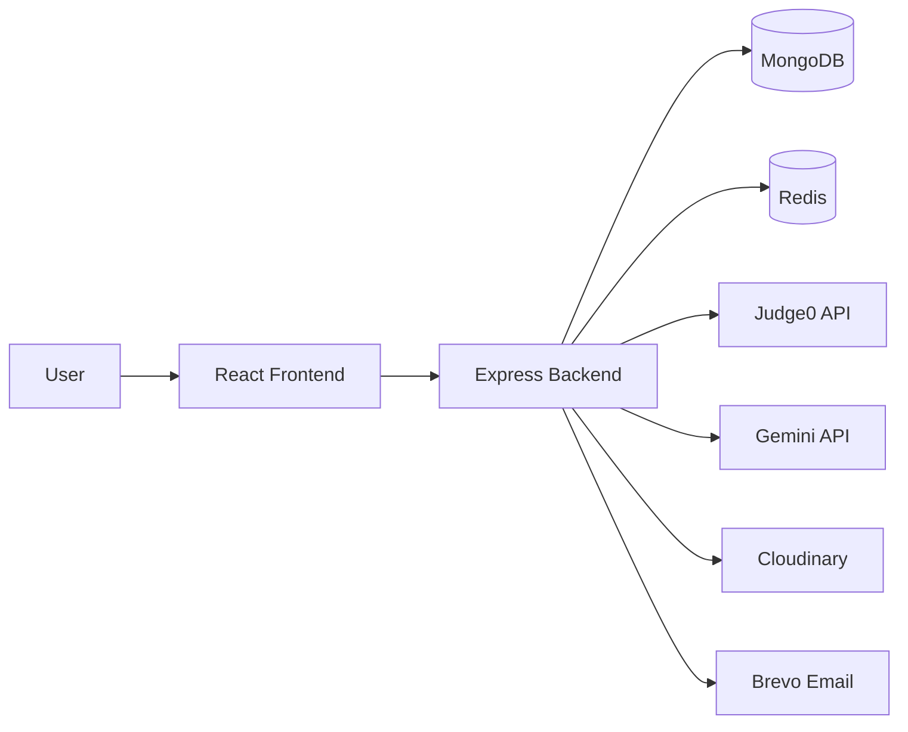

# Algovia

> A modern full-stack coding platform with authentication, coding problems, code execution, submissions, admin tooling, AI doubt solving, and editorial videos.

[](https://nodejs.org/)
[](https://react.dev/)
[](https://expressjs.com/)
[](https://www.mongodb.com/)
[](https://redis.io/)

## What Is Algovia?

Algovia helps learners practice DSA-style coding questions in a real interview-like workflow.
Users can authenticate, browse problems, run code, submit final answers, view history, and interact with AI-powered doubt solving. Admins can manage problems and editorial videos.

## Feature Highlights

| Area            | Highlights                                                    |
| --------------- | ------------------------------------------------------------- |
| Authentication  | Register, login, logout, OTP verification, JWT-based sessions |
| Problem Solving | Browse problem list, fetch problem by ID, solve with editor   |
| Code Execution  | Run code before submission and receive output                 |
| Submissions     | Submit final solutions and track submission history           |
| AI Help         | Ask coding doubts through Gemini-powered chat route           |
| Admin Panel     | Create, update, delete problems and manage solution videos    |

## Tech Stack

| Layer        | Technologies                                                           |
| ------------ | ---------------------------------------------------------------------- |
| Frontend     | React, Vite, Redux Toolkit, React Router, Axios, Tailwind CSS, DaisyUI |
| Backend      | Node.js, Express.js, Mongoose, Redis, JWT, Cookie Parser, CORS         |
| Integrations | Judge0 API, Gemini API, Cloudinary, Brevo                              |

## Architecture Flow



## Monorepo Structure

```text
Algovia/
|- backend/
|  |- src/
|  |  |- config/
|  |  |- controllers/
|  |  |- middleware/
|  |  |- models/
|  |  |- routes/
|  |  \- utils/
|  |- .env.example
|  \- package.json
|- frontend/
|  |- src/
|  |  |- components/
|  |  |- pages/
|  |  |- store/
|  |  \- utils/
|  |- .env.example
|  \- package.json
\- README.md
```

## Quick Start

### 1) Clone

```bash
git clone https://github.com/nilanshukumarsingh/Algovia.git
cd Algovia
```

### 2) Install Dependencies

Backend:

```bash
cd backend
npm install
```

Frontend:

```bash
cd ../frontend
npm install
```

### 3) Configure Environment Variables

Backend (`backend/.env`):

```dotenv
PORT=3000
DB_CONNECT_STRING=your_mongodb_connection_string
JWT_KEY=your_jwt_secret_key
REDIS_HOST=your_redis_host
REDIS_PORT=your_redis_port
REDIS_PASS=your_redis_password
GEMINI_KEY=your_google_gemini_api_key
CLOUDINARY_CLOUD_NAME=your_cloudinary_name
CLOUDINARY_API_KEY=your_cloudinary_api_key
CLOUDINARY_API_SECRET=your_cloudinary_api_secret
JUDGE0_KEY=your_judge0_rapidapi_key
BREVO_API_KEY=your_brevo_api_key
SENDER_EMAIL=your_sender_email@domain.com
EMAIL_USER=your_email@gmail.com
EMAIL_PASS=your_email_password
FRONTEND_URL=http://localhost:5173
```

Note: the current Redis config in `backend/src/config/redis.js` uses a fixed host and port and reads `REDIS_PASS` from env.

Frontend (`frontend/.env`):

```dotenv
VITE_API_BASE_URL=http://localhost:3000
```

### 4) Run The App

Backend (terminal 1):

```bash
cd backend
npm start
```

Frontend (terminal 2):

```bash
cd frontend
npm run dev
```

Open `http://localhost:5173`.

## Backend API Overview

| Base Path     | Description                                              |
| ------------- | -------------------------------------------------------- |
| `/user`       | Auth routes: register, login, verify OTP, profile checks |
| `/problem`    | Problem CRUD + solved/submitted problem data             |
| `/submission` | Run code and submit code by problem ID                   |
| `/ai`         | AI chat for doubt solving                                |
| `/video`      | Admin video upload metadata and delete routes            |

## Scripts

### Backend (`backend/package.json`)

| Command     | Description              |
| ----------- | ------------------------ |
| `npm start` | Start backend server     |
| `npm test`  | Placeholder test command |

### Frontend (`frontend/package.json`)

| Command           | Description              |
| ----------------- | ------------------------ |
| `npm run dev`     | Start Vite dev server    |
| `npm run build`   | Build production bundle  |
| `npm run preview` | Preview production build |
| `npm run lint`    | Run ESLint               |

## Security Notes

- Never commit real `.env` files.
- Rotate any credentials if they were ever exposed in public commits.
- Prefer using cloud secret managers for production deploys.

## Roadmap

- Leaderboard and streak system
- Better submission analytics dashboard
- Expanded language/runtime support
- More AI-guided hints and debugging support

## Contributing

1. Fork the repository.
2. Create a feature branch.
3. Commit your changes.
4. Open a pull request.

## Author

**Nilanshu Kumar Singh**

- Email: [nilanshukumarsingh2005@gmail.com](mailto:nilanshukumarsingh2005@gmail.com)
- GitHub: [nilanshukumarsingh](https://github.com/nilanshukumarsingh)

## Support

If this project helped you, give it a star on GitHub.
